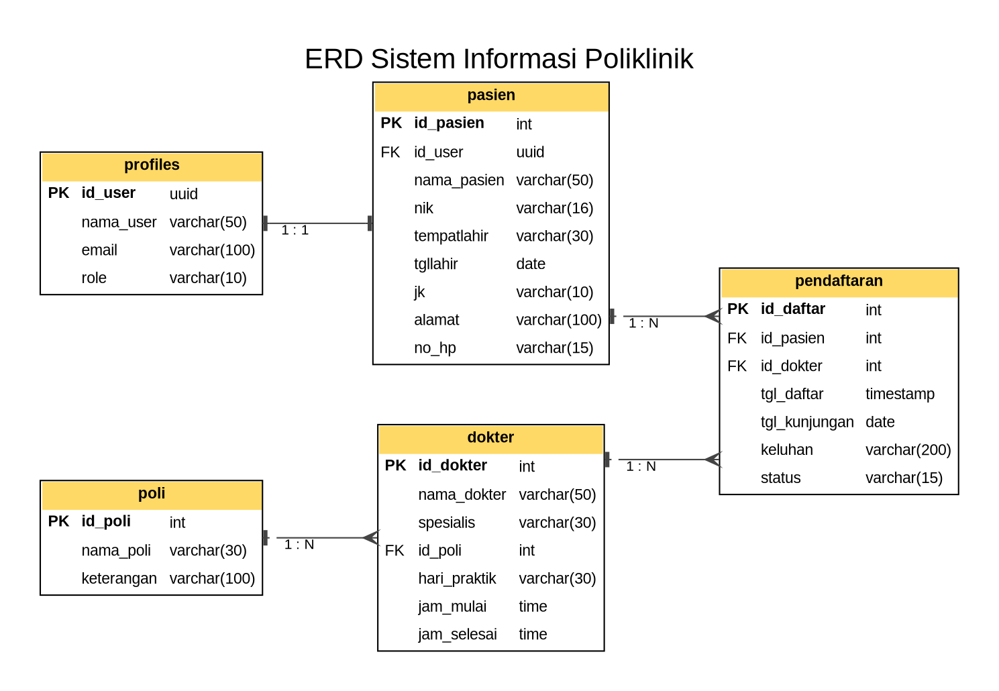

# Sistem Informasi Poliklinik

Website poliklinik untuk melihat jadwal dokter dan mendaftar berobat secara online.
Dibuat sebagai proyek Ujian Keahlian Kejuruan.

## Teknologi

- Next.js (App Router) + TypeScript
- Tailwind CSS
- Supabase (PostgreSQL + Auth + Row Level Security)
- Zod (validasi input)
- jsPDF + jspdf-autotable (laporan PDF), ExcelJS (laporan Excel)

## Fitur (progres)

- [x] Landing page: daftar poli dan jadwal dokter
- [x] Register, login, logout (password di-hash oleh Supabase Auth)
- [x] 2 peran: admin dan pasien, halaman dilindungi per peran
- [x] Dashboard admin (ringkasan data) dan dashboard pasien
- [x] CRUD poli, dokter, pasien (pencarian + pagination)
- [x] Pendaftaran berobat, riwayat, pembatalan, dan pengelolaan status oleh admin
- [x] Laporan pendaftaran (filter periode/poli/status) dengan unduh PDF dan Excel
- [ ] Deploy ke Vercel

## Cara menjalankan

1. Pasang Node.js (versi LTS) dan Git.
2. Clone repositori lalu pasang dependensi:
   ```bash
   git clone <url-repo-ini>
   cd poliklinik
   npm install
   ```
3. Buat project di [supabase.com](https://supabase.com). Di **SQL Editor**, jalankan berurutan
   `database/01_schema.sql` lalu `database/02_seed.sql`.
4. Salin `.env.example` menjadi `.env.local`, lalu isi URL dan publishable key dari
   **Project Settings -> API Keys**.
5. (Disarankan untuk demo) Di **Authentication -> Sign In / Providers -> Email**,
   matikan **Confirm email** agar pendaftaran langsung bisa login.
6. Buat akun admin: **Authentication -> Users -> Add user** (centang *Auto Confirm User*),
   lalu jalankan di SQL Editor:
   ```sql
   update public.profiles set role = 'admin' where email = 'EMAIL_ADMIN';
   ```
7. Jalankan:
   ```bash
   npm run dev
   ```
   Buka http://localhost:3000

## Akun demo

| Peran | Email | Password |
|-------|-------|----------|
| Admin | (isi) | (isi) |
| Pasien | (isi) | (isi) |

## ERD



## Struktur folder

```
database/   file SQL (skema dan data awal)
docs/       ERD dan dokumentasi
src/app/    halaman (landing, login, register, admin, pasien)
src/components/  komponen UI dan form yang dipakai ulang
src/lib/    koneksi Supabase, helper auth, validasi (zod), jadwal, query
src/proxy.ts  penyegar sesi login dan pelindung halaman
```
